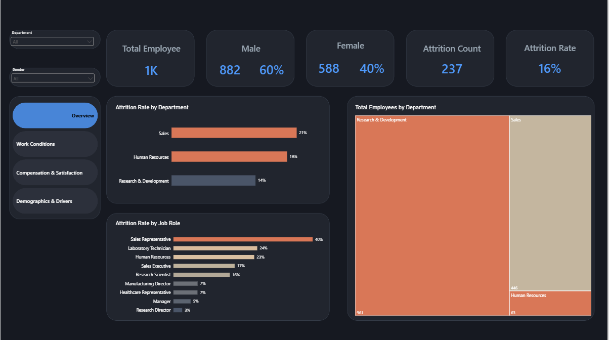
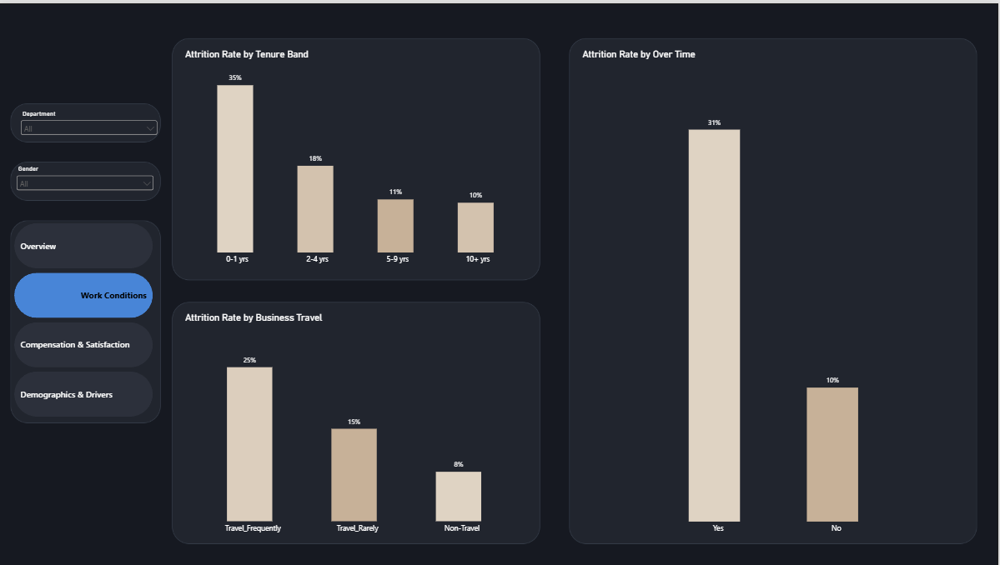
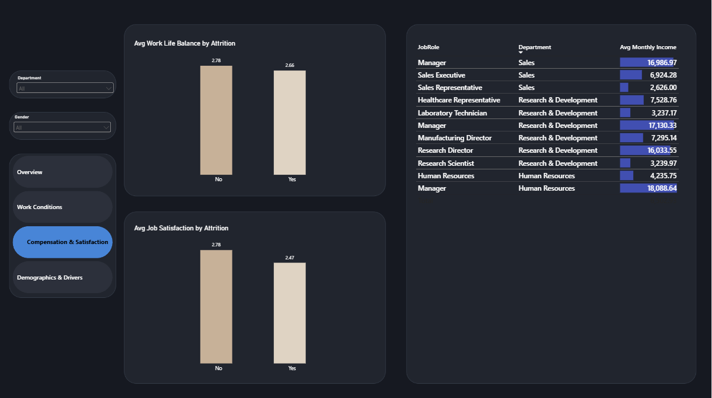
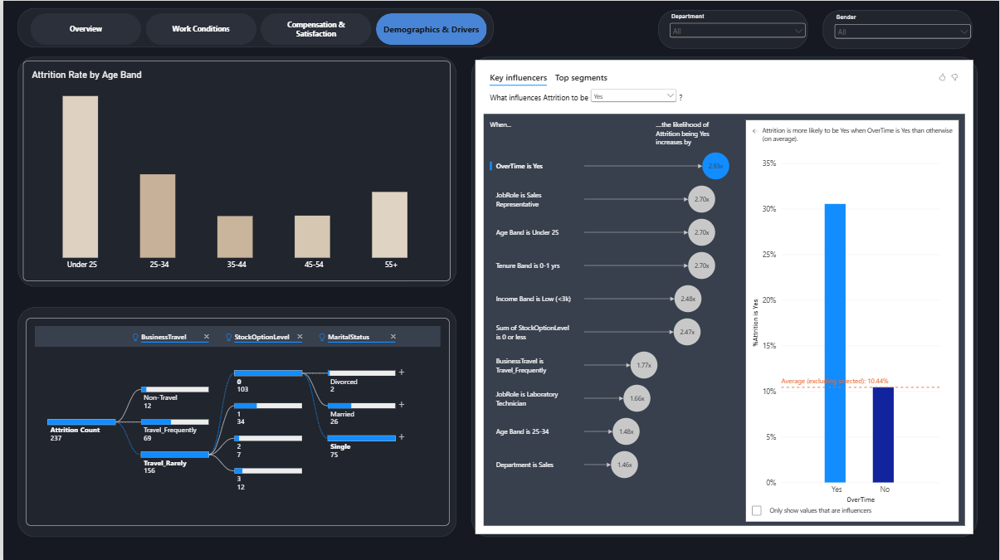

# HR Employee Attrition Analysis

An end-to-end analytics project digging into why employees leave, built on IBM's classic HR attrition dataset (1,470 employees, 35 attributes). Python handles the cleaning, Power BI handles the storytelling.

## The question

Attrition is expensive: recruiting, onboarding, lost productivity, it all adds up. This project set out to answer a practical set of questions HR would actually ask:

- What's the overall attrition rate, and which departments and job roles are hit hardest?
- Does overtime, business travel, or tenure actually relate to who leaves?
- How does pay compare across departments and roles, and does job satisfaction differ between stayers and leavers?
- Which age groups and employee segments have the highest turnover?
- What should HR actually do about it?

## Pipeline

**Python (pandas)** → clean the raw data, engineer the fields the dashboard needs, export a Power BI-ready CSV
**Power BI** → build the interactive dashboard across four pages
**GitHub** → document and ship

### Cleaning & feature engineering

The raw dataset was already in decent shape (no nulls, no duplicates), so the Python work focused on trimming dead weight and building the columns Power BI would need:

- Dropped three constant columns (`EmployeeCount`, `Over18`, `StandardHours`) that carried zero analytical value
- Built `AttritionFlag`, a 0/1 numeric version of the target variable, since DAX measures need something to sum
- Binned `Age` into age groups and `YearsAtCompany` into tenure bands
- Converted the 1-4 satisfaction and work-life balance scales into readable labels (e.g., `3 - High` instead of a bare `3`)
- Split `MonthlyIncome` into salary quartiles for compensation comparisons

Full script and cleaned dataset are in this repo.

## The dashboard

Four pages, each answering a different slice of the question set.

### Overview

Headcount, gender split, and the top-line attrition numbers, plus attrition by department and by job role. Sales Representatives jump out immediately at a 40% attrition rate, more than double any other role.

### Work Conditions

This is where the strongest signal in the whole dataset shows up: employees working overtime leave at 31%, versus 10% for those who don't. Tenure tells a similar story. New hires in their first year churn at 35%, and that rate drops off fast the longer someone stays. Frequent travelers also leave at roughly 3x the rate of employees who don't travel for work.

### Compensation & Satisfaction

Job satisfaction and work-life balance are both lower among employees who left, but the gap is smaller than you'd expect (2.47 vs 2.78 for satisfaction, on a 4-point scale). Pay tells a clearer story: Managers and Research Directors earn far more than individual contributors, and Sales Representatives sit at the bottom of the pay scale in a role that's already bleeding people.

### Demographics & Drivers

Under-25 employees have the highest attrition of any age band by a wide margin. The decomposition tree breaks attrition down by business travel, stock options, and marital status, and the Key Influencers visual backs up what the earlier pages hinted at: overtime is the single strongest predictor of attrition (2.93x more likely), followed by being a Sales Representative, being under 25, and being in your first year on the job.

## What the data says

Put it all together and the picture is consistent, not scattered. The people most likely to leave are young, early in their tenure, working overtime, traveling frequently, and often in Sales. These factors compound: a Sales Rep under 25 who's been there less than a year and works overtime isn't a handful of separate risk factors, it's one high-risk profile.

**Key numbers:**

| Metric | Value |
|---|---|
| Overall attrition rate | 16.1% |
| Attrition with overtime | 30.5% (vs. 10.4% without) |
| Attrition, Sales Representatives | 39.8% |
| Attrition, under-25s | 35.8% |
| Attrition, first-year employees | 29.8% |
| Attrition, frequent travelers | 24.9% (vs. 8.0% for no travel) |

## Recommendations

Overtime is the biggest lever here. If it's baked into how Sales operates, the fix is staffing or pay, not just asking people to grind through more hours.

The first year is where the company bleeds people fastest, nearly a third of new hires don't make it past year one. Earlier check-ins and a visible promotion path would probably catch some of that before it turns into a resignation.

Sales Representative pay is worth a hard look too. It's the lowest-paid role in the dataset and also the one with the worst attrition. Those two facts sitting next to each other aren't a coincidence.

Travel policy for junior staff is the smaller fix, but still worth doing: frequent travelers leave at three times the rate of people who stay put, and that's a pattern early-career employees feel more than anyone.

## Tools

Python (pandas) · Power BI (DAX, Power Query) · Figma (wireframing)

## Dataset

[IBM HR Analytics Employee Attrition & Performance](https://www.kaggle.com/datasets/pavansubhasht/ibm-hr-analytics-attrition-dataset), via Kaggle.
