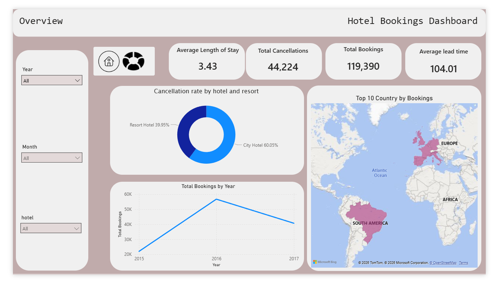
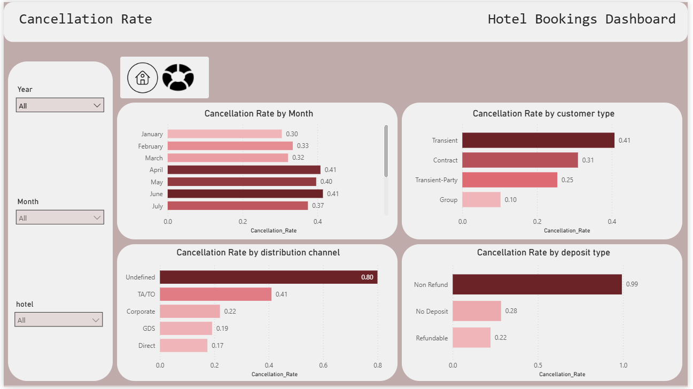

# Hotel Bookings Analysis

I wanted to dig into a hotel booking dataset and figure out why so many reservations end up cancelled, and what the hotel could actually do about it. This project follows my usual pipeline: clean the data in Python, sketch the dashboard layout in Figma, then build it out in Power BI.

## The dataset

The data comes from a public hotel bookings dataset: about 119,000 reservations across a City Hotel and a Resort Hotel, covering 2015 to 2017. Each row is one booking. Lead time, arrival date, room type, cancellation status, deposit type, and a bunch more.

## Step 1: Cleaning in Python

I kept the cleaning script focused on the basics. Nothing fancy, just getting the data into a shape Power BI can work with reliably.

**Missing values**, and how I handled each one:

- `agent` and `company`: these are ID codes, not real quantities, so filling them with a mean or median would've been meaningless. A missing value here actually means "no agent" or "no company," not "unknown." I filled both with `0` and cast them to strings so they'd stay categories, not numbers.
- `country`: unlike agent/company, a missing country genuinely means unknown, not "not applicable." It's less than 0.5% of the data, so I filled it with `"Unknown"` rather than guessing or dropping the rows.
- `children`: a small number of missing values here. Handled with a simple fill so the column stays usable.

I intentionally left derived or analysis-only columns (like flags for "booked via agent") out of the Python script. Those are better handled as DAX in Power BI, since they're more about how I analyze the data than about cleaning it.

## Step 2: Wireframing in Figma

Before touching Power BI, I sketched the page layouts in Figma: title bar, slicer panel, and a rough grid for where each chart would sit. It's the same habit I've used on earlier projects (Port 1 started this way too), and it's a lot cheaper to move boxes around in Figma than to rebuild visuals in Power BI after the fact.

## Step 3: Building the dashboard in Power BI

Once the cleaned CSV was ready, I brought it into Power BI and built out the measures and visuals.

**Core measures** (all built one at a time in a dedicated measures table):
- Total Bookings
- Total Cancellations
- Cancellation Rate
- Average Lead Time
- Average Length of Stay
- Average ADR

I hit a wall trying to sort `arrival_date_month` with a `SWITCH`-based sort key column. Power BI kept throwing a circular dependency error, and it survived a deleted column, a renamed column, and even a brand new file. I never fully cracked it. Eventually I let it go and focused on getting the report content right instead.

### Page 1: Overview

This page sets the context before diving into cancellations: total bookings, total cancellations, average length of stay, and average lead time up top, then a breakdown of cancellation rate by hotel type, a map of the top countries generating bookings, and a look at booking volume by year.

### Page 2: Cancellation Rate

This page is the deep dive into what's actually driving cancellations, broken out by month, customer type, distribution channel, and deposit type. Two things jumped out immediately:

- Bookings through an **undefined distribution channel** cancel at a rate of **0.80**. That's way higher than any of the named channels.
- Bookings with a **non-refundable deposit** cancel at a rate of **0.99**. Basically guaranteed to cancel, which is the opposite of what I expected going in.

## Questions this dashboard answers

- **What is the overall booking cancellation rate?** Roughly 37%. See the Total Bookings and Total Cancellations KPI cards on the Overview page.
- **Which hotel type has the highest cancellation rate?** The donut chart on the Overview page breaks this down.
- **Which months receive the most bookings?** Covered by the yearly trend on the Overview page for now. A month-level breakdown is on my list.
- **Which months have the highest cancellation rates?** April and June, both at 0.41. That's in the "Cancellation Rate by Month" chart on the Cancellation Rate page.
- **Which countries generate the most bookings?** The map on the Overview page shows the top countries by volume.
- **How far in advance do customers make reservations?** About 104 days on average, per the Average Lead Time card.
- **Does lead time relate to cancellations?** Not built yet. I'm planning a lead-time-bucketed breakdown for the Cancellation Rate page.
- **Which customer types have the highest cancellation rates?** Transient guests, at 0.41, per the "Cancellation Rate by customer type" chart.
- **How does booking channel affect cancellations?** Bookings through an undefined channel cancel at 0.80, far above any named channel. That's the "Cancellation Rate by distribution channel" chart.
- **How does deposit type relate to cancellations?** Non-refundable deposits cancel at 0.99. Honestly, the most surprising number in the whole dashboard.
- **What is the average length of stay?** About 3.43 nights, from the Average Length of Stay card.
- **Which room types are booked most frequently?** Not built yet; planned for the Overview page.
- **How does seasonality affect hotel demand?** Partly answered by the yearly trend line. Still need a proper month-level view.
- **What recommendations could help the hotel reduce cancellations and improve revenue?** Not written up yet. It'll probably centre on the deposit type and distribution channel findings above since those are the two clearest levers I've found.

## What's next

- Adding recommendations based on these patterns (starting with the deposit type and distribution channel findings above)
- Possibly revisiting the month-sort issue with a proper date table approach

## Tools used

- **Python** (pandas): data cleaning
- **Figma**: dashboard wireframing
- **Power BI**: dashboard and DAX measures
- **Dataset**: Public hotel bookings dataset (CSV)
