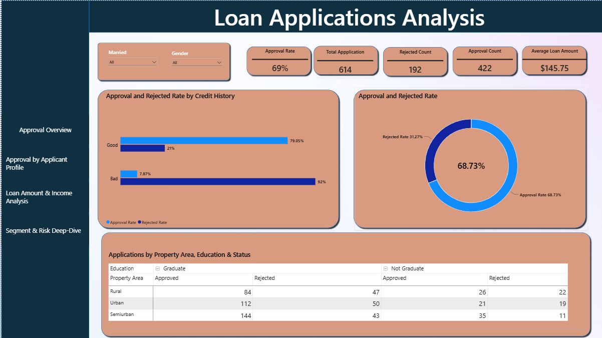
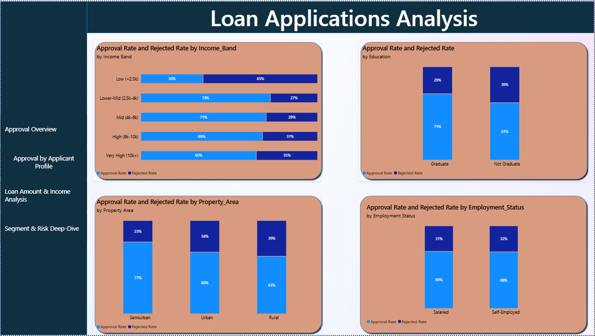
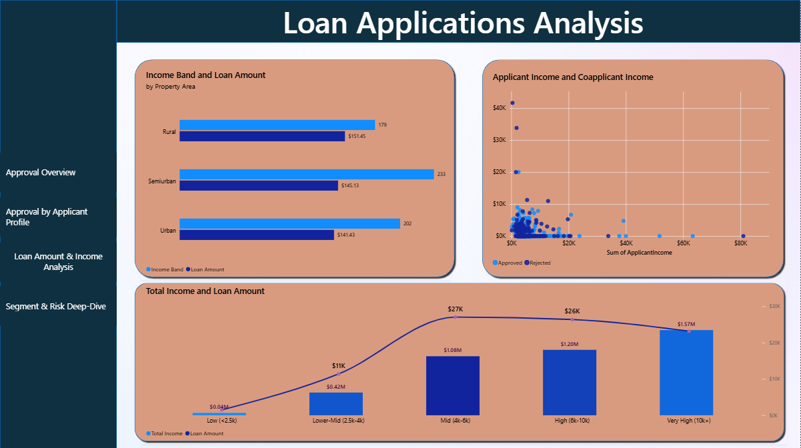
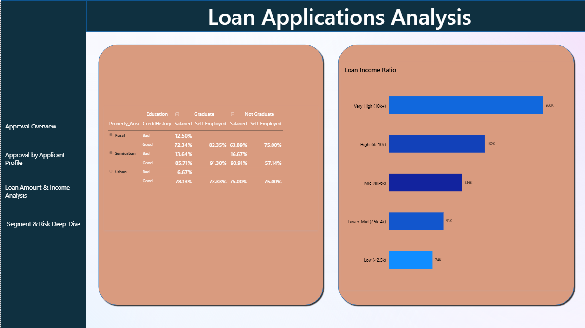

# Loan Applications Analysis

This project looks at 614 loan applications and tries to answer the questions a loan company's underwriting team actually cares about: who gets approved, why, and where the process might be leaving money on the table or treating people unfairly.

Pipeline: Python for cleaning and EDA, Power BI for the dashboard, DAX for the derived columns and measures.

## The dataset

614 rows, one per loan application. Columns cover applicant demographics (Gender, Married, Dependents, Education, Self_Employed), financials (ApplicantIncome, CoapplicantIncome, LoanAmount, Loan_Amount_Term), Credit_History, Property_Area, and the outcome, Loan_Status.

Missing values existed in Gender, Married, Dependents, Self_Employed, Loan_Amount_Term, Credit_History, and LoanAmount. Categorical gaps were filled with the mode. LoanAmount, the one continuous numeric field with missing values, was filled with the median instead, since income and loan amounts here are right-skewed and mean imputation would have been thrown off by a handful of large loans.

## Business questions

1. What percentage of loan applications are approved?
2. How many applications are approved versus rejected?
3. How does loan approval differ by income level?
4. How does loan approval differ by employment status?
5. How does loan approval differ by education level?
6. Does credit history relate to loan approval?
7. What is the average loan amount?
8. Which customer groups request the largest loans?
9. How does property area relate to loan applications?
10. Which customer segments have the highest approval rates?
11. How does applicant income compare with co-applicant income?
12. What patterns appear among approved and rejected applications?
13. What recommendations would improve the bank's loan assessment process?

## Key findings

Credit history is doing almost all the work. Applicants with good credit history get approved 79% of the time. Applicants with bad credit history get approved 8% of the time. That's not a small gap, and a chi-square test on Credit History vs Loan Status came back with a p-value of 3.42e-40, so this isn't noise.

Raw income barely matters. Correlation between ApplicantIncome, CoapplicantIncome, LoanAmount and approval outcome all sit near zero. A logistic regression using Credit History, Income Band, and Education as predictors hit 81% training accuracy, and Credit History's coefficient (3.33) dwarfed Income Band (0.09) and Education (-0.32). If you're an applicant with clean credit, the rest of your financial profile barely moves the needle.

Loan-to-income ratio climbs with income band. Very High earners carry an average loan-to-income ratio of 260K, versus 74K for the Low band. Higher earners aren't just taking bigger loans in absolute terms, they're taking bigger loans relative to what they make too, which is worth a second look from a risk standpoint.

Education gaps show up unevenly by region. Not Graduates get approved less often everywhere, but the gap is widest in Urban areas (69% for Graduates vs 52% for Not Graduates) and narrowest in Semiurban (77% vs 76%). Worth asking whether that's real risk difference or something about how the Urban underwriting process treats education level.

Outliers aren't skewing the headline numbers. 50 income outliers and 41 loan amount outliers exist by the IQR method, but removing them only moves the overall approval rate from 68.7% to 69.4%.

## Recommendations

- Credit history is carrying the underwriting decision almost single-handedly. Worth checking whether the other data being collected (income, employment status, education) is actually informing decisions or just adding friction for applicants who already have the answer written in their credit file.
- The Urban education gap deserves a closer look. A 17-point approval gap between Graduates and Not Graduates in one region, versus a 1-point gap in another, suggests something regional is going on beyond just education level.
- Loan-to-income ratio should probably factor into approval decisions more explicitly for high earners, since the data shows they're being approved for proportionally larger loans without an obvious check on that ratio.

## Dashboard

Five pages, built natively in Power BI. Married and Gender slicers sit at the top of the report and carry across pages.

### Approval Overview

KPI strip (Approval Rate, Total Applications, Rejected Count, Approval Count, Average Loan Amount), approved/rejected donut, approval rate by credit history, and a cross-tab table of approvals and rejections by Property Area and Education.

The credit history gap shows up immediately here: 79% approval for Good credit, 8% for Bad. That single chart carries most of the story this dashboard tells.

### Approval by Applicant Profile

Approval and rejection rate, shown as 100% stacked bars, broken out by Income Band, Education, Property Area, and Employment Status.

Property Area has the widest spread here: Semiurban approves 77% of applications, Rural only 61%. Employment status barely matters, Salaried and Self-Employed sit within a point of each other.

### Loan Amount & Income Analysis

Average loan amount by property area, the applicant income vs co-applicant income scatter, and total income vs loan amount trended across income bands.

The scatter makes the co-applicant income pattern visible at a glance, most applicants cluster near zero co-applicant income regardless of approval outcome, with no obvious separation by color. The income vs loan amount line flattens out past the Mid band, so loan sizing doesn't keep scaling linearly with income at the top end.

### Segment & Risk Deep-Dive

A nested approval-rate table by Property Area, Credit History, Education, and Employment Status, plus average loan-to-income ratio by income band.

This page is where the loan-to-income finding lives: 260K for Very High earners versus 74K for Low earners. Worth a second look from a risk standpoint, since it means higher earners aren't just borrowing more, they're borrowing more relative to what they make.

### Calculated columns (DAX)

Built as calculated columns in the LoanCln table rather than in Python, so the derivation logic lives in Power BI:

- `TotalIncome`: ApplicantIncome + CoapplicantIncome
- `Income_Band`: 5 buckets from TotalIncome
- `Loan_Status_Label` / `Loan_Status_Flag`: readable label and numeric flag from Loan_Status
- `Credit_History_Label`: Good/Bad from the 1/0 flag
- `Employment_Status`: Salaried/Self-Employed from Self_Employed
- `Loan_Income_Ratio`: LoanAmount relative to TotalIncome
- `Has_Coapplicant`: Yes/No flag
- `Dependents_Numeric`: numeric version of Dependents, with "3+" mapped to 3

One gotcha worth flagging for anyone rebuilding this: sorting Income_Band by a separate sort-key column that referenced Income_Band directly threw a circular dependency error, repeatedly, even after recreating the column from scratch. Fixed by rebuilding the sort key independently from TotalIncome instead of from Income_Band, so there's no reference chain back to the column being sorted.

## Tools

Python (pandas), Power BI (Power Query, DAX), Git.
